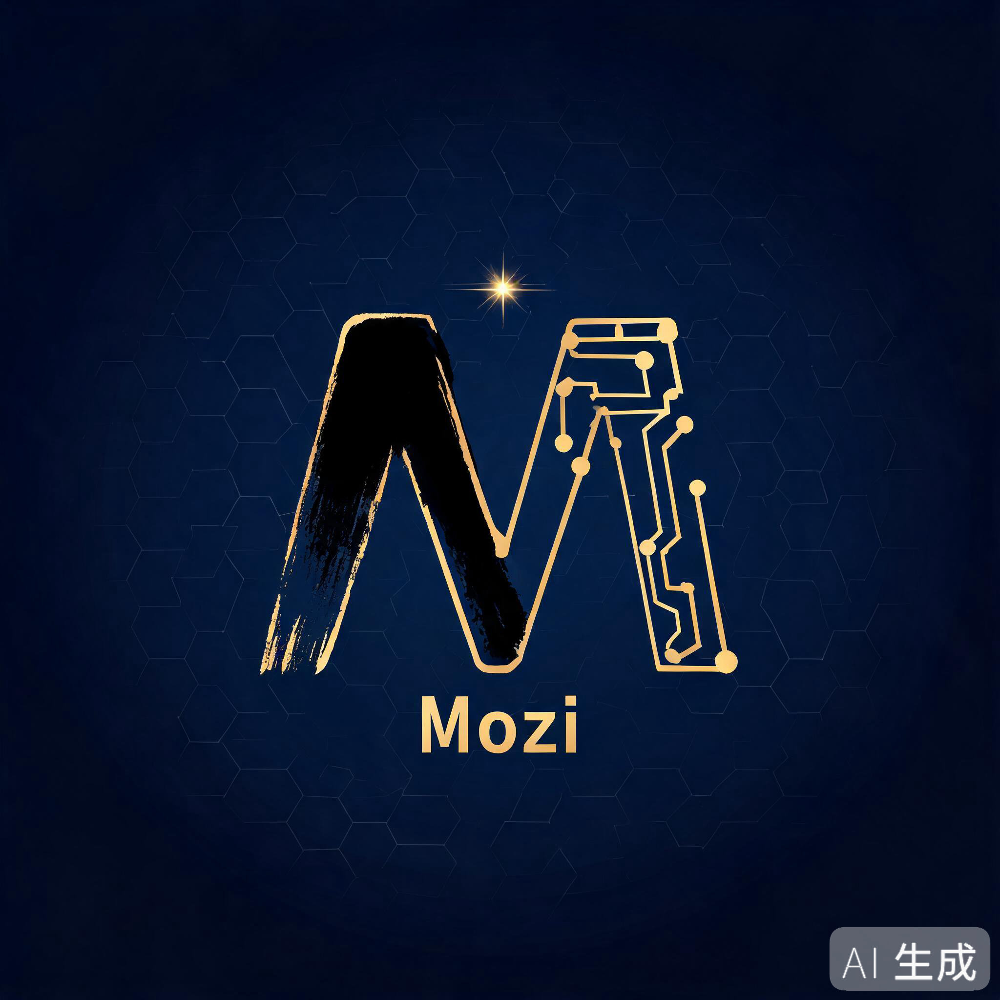

---
AIGC:
  ContentProducer: '001191110102MAD55U9H0F10002'
  ContentPropagator: '001191110102MAD55U9H0F10002'
  Label: '1'
  ProduceID: 'd8afd8c1-a2b4-4db7-ab1f-1762ad5c8482'
  PropagateID: 'd8afd8c1-a2b4-4db7-ab1f-1762ad5c8482'
  ReservedCode1: 'ea78e50c-c2b9-411e-8e8d-da35097e3cb1'
  ReservedCode2: 'ea78e50c-c2b9-411e-8e8d-da35097e3cb1'
---

<div align="center">
  
</div>

# 墨子 (Mozi)

**English** | [简体中文](README.zh-CN.md)

**An open-source coding agent that lives in your machine.**

> 墨家，中国古代唯一的「工程师学派」——机关术造工具，名辩术讲逻辑，守城术筑安全。
> Mozi 是这三件事的现代实现：工具系统 · Agent Loop · 四级沙箱。

## What is Mozi?

Mozi is a TypeScript coding agent (think Codex CLI / Claude Code) with one difference: **the engine is the product.**

- **CLI + Desktop + Mobile** — three shells, one engine, one event protocol
- **Sub-agents** — delegate isolated-context tasks (explore / general / reviewer)
- **Scheduled tasks** — cron-driven unattended execution with git-worktree isolation
- **Multi-model** — OpenAI / Anthropic / DeepSeek / Qwen / Ollama, first-class
- **Full MCP client** — stdio + Streamable HTTP, tools/resources/prompts/sampling
- **Local-first** — engine runs on your machine; E2E-encrypted self-hosted relay for mobile

## Status

**M0 — project bootstrap.** See `docs/` for the full design:

| Doc | Content |
|-----|---------|
| `docs/仿Codex-Agent开发技术方案.md` | Design doc: goals, architecture, milestones M0–M5 |
| `docs/Mozi-详细设计文档.md` | Detailed design: 18 modules (M1–M18), implementation-ready |

## Quick Start (dev)

```bash
# Requirements: Node >= 20, pnpm >= 9
pnpm install
pnpm build
pnpm test
```

## Repository Layout

```
packages/
  shared/        # DTOs: events, messages, error codes (zero deps)
  core/          # AgentEngine, ContextManager, SessionStore, sub-agents, tasks
  policy/        # Approval policy engine + command risk analysis
  tools/         # Built-in tools + PatchEngine (apply_patch)
  providers/     # LLM adapters + ScriptedProvider (deterministic testing)
  sandbox/       # Four-level sandbox (L0–L3)
  mcp-client/    # Full MCP client
  config/        # Layered configuration
  protocol/      # Unified channel semantics (in-process / IPC / WSS)
  relay-server/  # Self-hosted E2E relay (zero-content router)
  tui/           # Ink terminal UI
  desktop/       # Electron app
apps/
  cli/           # `mozi` binary
  mobile/        # Expo / React Native client
benchmark/       # Eval task suite (L1–L4)
docs/            # Design documents
examples/        # Engine embedding examples
```

## License

[MIT](./LICENSE)

> AI生成